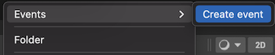
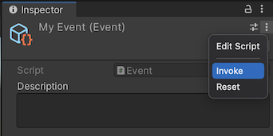
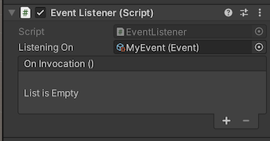
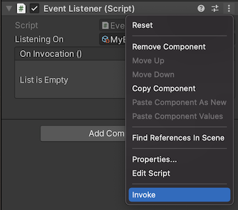

# Unity Events
Unity3d package allowing the invocation and interpretation of custom events through ScriptableObjects.

This project is inspired on the [presentation](https://youtu.be/raQ3iHhE_Kk?t=1673) by [Ryan Hipple](https://twitter.com/roboryantron).

Feedback is welcome.

## Plug and Play
1. Open "Package Manager"
2. Choose "Add package from git URL..."
3. Use the HTTPS URL of this repository:
   `https://github.com/yanicksenn/unity-events.git#1.0.0`
4. Click "Add"

## Usage
- [Event](#user-content-event)
- [Invoking](#user-content-invoking)
- [Listening](#user-content-listening)

### Event

Events can be created through the asset menu > Create > Events > ... .



### Invoking

This package provides you with events.

```c#
public class MyBehaviour : MonoBehaviour
{
    public Event myEvent;
    
    private Start()
    {
        myEvent?.Invoke();
    }
}
```

For testing purposes you can also invoke events through the context menu.



### Listening

Game objects can listen to events by having the component `EventListener`. A game object can hold multiple `EventListener` components.



For testing purposes you can invoke events through the context menu of the component aswell.


